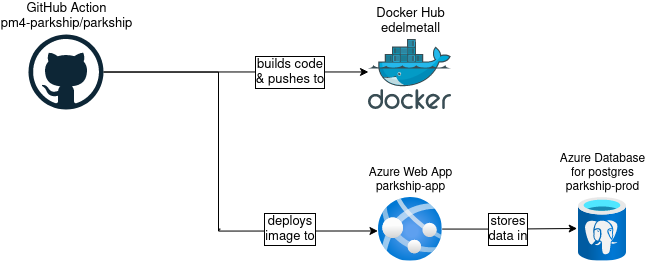
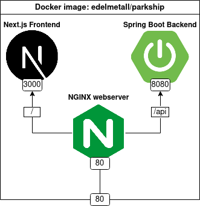

# CI/CD Documentation
## Actions
### 1. build-push-deploy.yaml
- On creating a pull request to main... 
- On pushing to the main branch...

the following actions happen:

#### job: buildpush
_runs-on: ubuntu-latest Github-hosted runner_

1. Checkout repository to runner
2. Set up JDK version 17 for backend
3. Test and build backend with maven
4. Set up node.js version 18 for frontend
5. Install frontend npm packages
6. Run frontend tests
7. Build frontend with npm
8. Set up Docker Buildx
9. Login to Docker Hub
10. Build and push application to Docker Hub

#### job: deploy
_runs-on: ubuntu-latest Github-hosted runner_ 
_needs: buildpush_
 
1. Deploy to Azure Web App

---

### 2. ci-backend.yaml
- On pushing to any (*) branch, which is not main...

the following actions happen:

#### job: buildpush
1. Checkout repository to runner
2. Set up JDK version 17 for backend
3. Test and build backend with maven

---

### 3. pr-size.yaml
- On creating a pull request...

the following actions happen:

#### job: pr-size
_runs-on: ubuntu-latest Github-hosted runner_

1. Adds size label to pull request

## Deployment Setup
### Workflow

---

### Image Content

